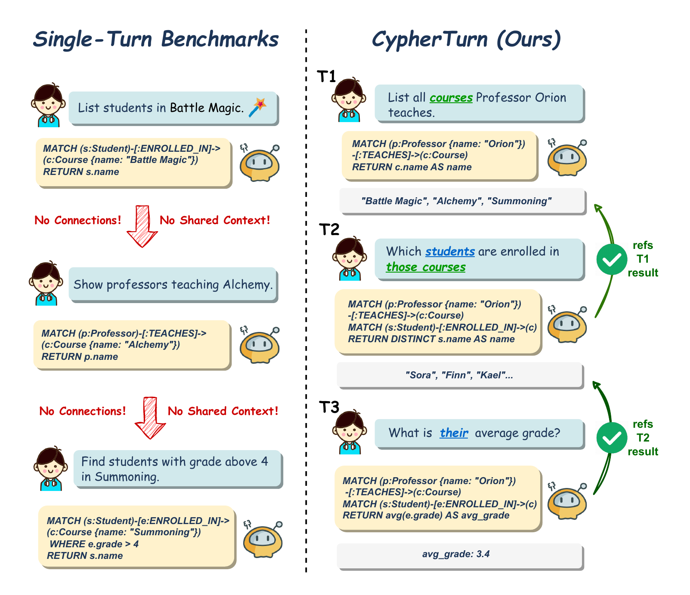
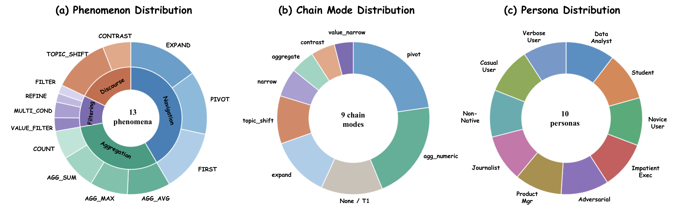
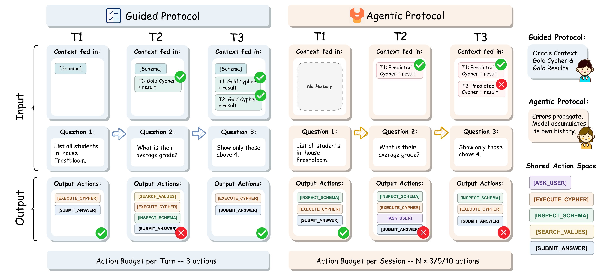
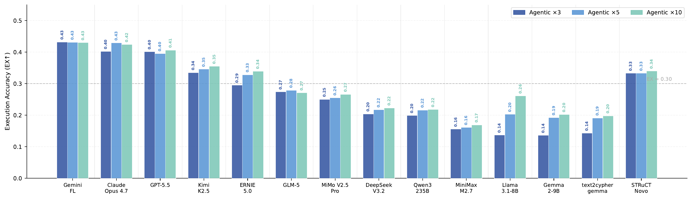
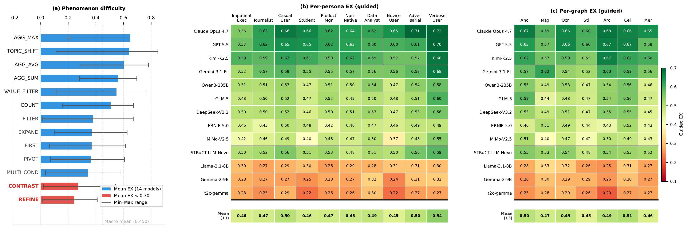
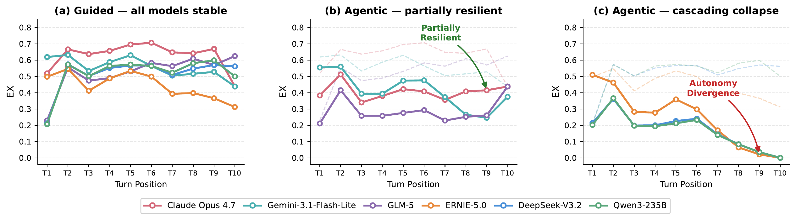
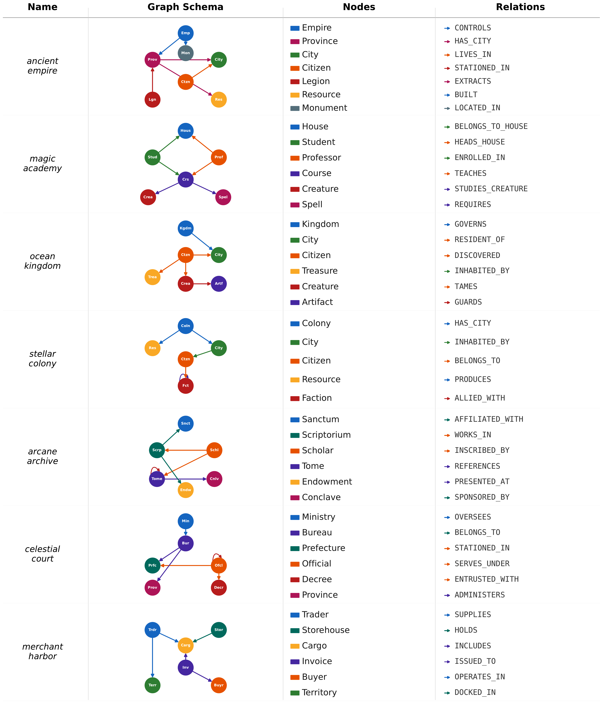

# CypherTurn

**A Multi-Turn Benchmark for Conversational Text-to-Cypher Evaluation and the Autonomy Divergence**



CypherTurn is the first benchmark for evaluating **multi-turn conversational Text-to-Cypher** generation. Every prior Text-to-Cypher dataset evaluates isolated single-turn queries; CypherTurn instead evaluates sessions of chain-dependent turns, where each query must be grounded in its predecessor's result. It also ships the first fully autonomous agentic evaluation protocol for property-graph Cypher, so error propagation can be measured directly rather than assumed.

> The codebase internally uses the working name `GraphTurn` (module docstrings, the CLI description). `GraphTurn` and `CypherTurn` refer to the same project; the paper name is **CypherTurn**.

---

## 📊 Key Statistics

| Metric | Value |
|--------|-------|
| Sessions | 721 |
| Turns | 5,927 |
| Knowledge Graphs | 7 (purpose-built, synthetic) |
| Conversational Phenomena | 13 |
| User Personas | 10 |
| Chain Modes | 9 |
| Mean Turns / Session | 8.2 |
| Inter-annotator Agreement | Cohen's κ = 0.83 |
| Models Evaluated | 15 (10 frontier API · 2 small open-source · 3 fine-tuned) |

---

## ✨ What's New

- **Multi-turn, not single-turn.** Every session is a coherent chain; turn *t* depends on the result set of turn *t−1*, exposing anaphora resolution and result-set propagation that single-turn benchmarks hide.
- **Two complementary protocols.** A *Guided* protocol supplies gold-annotated oracle history (upper bound on generation skill); an *Agentic* protocol forces the model to discover the schema, manage its own history, and self-correct under a shared action budget (mirrors deployment).
- **The Autonomy Divergence.** Guided and agentic rankings are correlated overall (Spearman ρ = 0.87), yet autonomy disproportionately degrades a few frontier models — enough to reorder the top of the leaderboard in a way invisible under oracle context.
- **Reproducible infrastructure.** Seven Neo4j instances via Docker Compose, pinned graph data, deterministic metrics (EX / PSJS / CER / SEM), and `temperature=0` decoding.

---

## 🏆 Main Results

Turn-level Execution Accuracy (EX) under both protocols, plus session-level Session Exact Match (SEM). ΔEX = agentic − guided (lower is better).

| Model | Guided EX ↑ | Guided SEM | Agentic×3 EX ↑ | Agentic SEM | ΔEX ↓ |
|-------|:----------:|:----------:|:---------------:|:-----------:|:-----:|
| Claude Opus 4.7 | **0.647** | **0.046** | 0.402 | **0.019** | −0.245 |
| GPT-5.5 | 0.625 | 0.025 | 0.401 | 0.006 | −0.224 |
| Kimi-K2.5 | 0.602 | 0.028 | 0.335 | 0.006 | −0.267 |
| Gemini-3.1-Flash-Lite | 0.572 | 0.017 | **0.432** | 0.008 | **−0.140** |
| Qwen3-235B | 0.513 | 0.006 | 0.199 | 0.001 | −0.314 |
| GLM-5 | 0.506 | 0.003 | 0.274 | 0.006 | −0.232 |
| DeepSeek-V3.2 | 0.506 | 0.004 | 0.204 | 0.000 | −0.302 |
| ERNIE-5.0 | 0.468 | 0.003 | 0.295 | 0.003 | −0.173 |
| MiMo-V2.5-Pro | 0.460 | 0.003 | 0.250 | 0.001 | −0.210 |
| MiniMax-M2.7 | 0.139 | 0.000 | 0.156 | 0.000 | +0.018 |
| Llama-3.1-8B | 0.291 | 0.000 | 0.137 | 0.000 | −0.154 |
| Gemma-2-9B | 0.281 | 0.000 | 0.136 | 0.000 | −0.145 |
| STRuCT-LLM-Novo | 0.526 | 0.015 | 0.333 | 0.003 | −0.193 |
| text-to-cypher-gemma | 0.261 | 0.000 | 0.143 | 0.000 | −0.118 |
| CypherRI-7B † | 0.013 | 0.000 | 0.001 | 0.000 | −0.012 |

> † CypherRI-7B's near-zero EX reflects a format-compliance failure from fill-in-the-middle token contamination in its RL training; it is excluded from aggregate statistics. See the paper for PSJS / CER / token-usage columns and the full analysis.

**Headline findings (see the paper for details):**
1. **Low ceilings.** The best model reaches only 64.7% guided EX; session-level correctness barely exceeds 4%.
2. **Autonomy Divergence.** Error-management under autonomy is partially independent of generation skill, reordering the top of the leaderboard (Gemini-3.1-Flash-Lite rises from 4th under guided to 1st under agentic).
3. **Budget ceiling.** Scaling actions from ×3 to ×10 does not close the gap — frontier models self-limit to ~2 actions/turn regardless of budget.
4. **Specialization paradox.** Single-turn Cypher fine-tuning *degrades* multi-turn performance, while architecture-appropriate RL specialisation beats several frontier models.

---

## 🖼️ Paper Figures

*Figure 1 — Single-turn benchmarks (left) vs. chain-dependent multi-turn sessions in CypherTurn (right).*



*Figure 2 — Benchmark composition across phenomena, chain modes, and personas.*



*Figure 3 — The Guided protocol (oracle context) vs. the Agentic protocol (autonomous, budgeted).*



*Figure 4 — Agentic EX under ×3 / ×5 / ×10 action budgets.*



*Figure 5 — Guided EX across three dimensions: phenomenon, persona, and graph.*



*Figure 6 — EX by turn position: stable under guided (a), plateau or collapse under agentic (b, c).*

<details>
<summary><b>Appendix figure — seven graph topologies</b></summary>



</details>

---

## 🚀 Quick Start

### 1. Install

```bash
pip install -r requirements.txt
```

### 2. Start the seven Neo4j instances

Each knowledge graph runs in its own Neo4j container on a dedicated port (7687–7693):

```bash
cd docker
export NEO4J_PASSWORD=password
docker compose up -d
```

### 3. Import the graph data

```bash
python scripts/import_graphs.py --all
```

### 4. Configure your model API

CypherTurn is API-agnostic: any OpenAI-compatible endpoint works (OpenAI, vLLM, Ollama, etc.).

```bash
export LLM_API_KEY=your-api-key
export LLM_BASE_URL=https://api.openai.com/v1
export NEO4J_HOST=localhost
export NEO4J_PASSWORD=password
```

### 5. Run an evaluation

```bash
# Guided protocol (oracle context, 3 actions/turn)
python -m eval.evaluator \
    --model gpt-4o \
    --protocol guided \
    --output_dir output/guided_gpt4o

# Agentic protocol (autonomous, shared budget)
python -m eval.evaluator \
    --model gpt-4o \
    --protocol agentic \
    --budget 3 \
    --sim_model gpt-4o \
    --output_dir output/agentic3_gpt4o
```

Budget multiplier options: `3` (default), `5`, or `10`. The agentic protocol additionally requires a user-simulator model (`--sim_model`).

<details>
<summary><b>Using a local model (vLLM / Ollama)</b></summary>

```bash
export LLM_BASE_URL=http://localhost:8000/v1
export LLM_API_KEY=dummy
python -m eval.evaluator --model my-model --protocol guided --output_dir output/guided_local
```
</details>

---

## 📐 Metrics

| Metric | Level | Definition |
|--------|-------|------------|
| **EX** | Turn | Execution Accuracy — 1 iff predicted and gold queries return identical result sets (rows **and** column names). |
| **PSJS** | Turn | Provenance Subgraph Jaccard Similarity — overlap of internal node element-IDs bound during pattern matching; diagnoses correct traversal but wrong output formatting. |
| **CER** | Turn | Chain Error Rate — P(EX_t = 0 \| EX_{t−1} = 0) over chain-dependent turns; quantifies error cascades. |
| **SEM** | Session | Session Exact Match — 1 iff every turn in the session achieves EX = 1. |

All metrics are computed by re-executing both predicted and gold Cypher against the live Neo4j instance, so correctness is judged on real result sets, not string match.

---

## 🗂️ Project Structure

```
.
├── config.py              # Env-var based configuration + graph→port map
├── models.py              # Pydantic data models (Session / Turn / Action / Phenomena)
├── api_client.py          # OpenAI-compatible LLM client
├── neo4j_utils.py         # Neo4j connectors, schema loading, action space
├── validate_benchmark.py  # Benchmark integrity checks (counts, phenomena, chain deps)
├── eval/
│   ├── evaluator.py       # Entry point — orchestrates evaluation + aggregation
│   ├── guided_runner.py   # Guided protocol (oracle history)
│   ├── agentic_runner.py  # Agentic protocol (autonomous, shared budget)
│   ├── user_sim_eval.py   # Persona-aware user simulator with anti-leakage
│   └── metrics.py         # EX / PSJS / CER / SEM computation + aggregation
├── prompts/
│   └── eval_prompts.py    # Action-space system + per-protocol turn prompts
├── graph_eval_utils/      # Neo4j connector + EX & PSJS metric implementations
├── data/
│   ├── scenarios/         # 7 per-graph benchmark files (721 sessions, 5,927 turns)
│   └── graphs/            # Per-graph schema.json + data.cypher import scripts
├── docker/
│   └── docker-compose.yml  # Seven Neo4j 5.15 containers on ports 7687–7693
├── scripts/
│   ├── import_graphs.py   # Graph data importer
│   └── run_eval.sh        # Example evaluation commands
├── assets/                # Figures and tables from the paper
└── requirements.txt
```

---

## 📁 Data Format

Benchmark data is split into 7 files (one per graph) in `data/scenarios/`:

```
data/scenarios/
├── ancient_empire_sessions.json
├── arcane_archive_sessions.json
├── celestial_court_sessions.json
├── magic_academy_sessions.json
├── merchant_harbor_sessions.json
├── ocean_kingdom_sessions.json
└── stellar_colony_sessions.json
```

Each file is a JSON array of **sessions**. Each session has `session_id`, `graph`, `persona`, and a `turns` array. Each turn carries:

| Field | Description |
|-------|-------------|
| `turn_id` | Position in the session |
| `user_utterance` | Natural-language question |
| `gold_cypher` | Ground-truth Cypher query |
| `gold_answer` | Execution result of the gold query |
| `phenomena` | List of conversational phenomenon tags (one of 13) |
| `chain_mode` | How this turn relates to its predecessor (one of 9) |
| `depends_on_result_of` | Turn ID this turn builds on (`null` for independent turns) |
| `skeleton` | Structured query skeleton used during construction |

---

## 🌐 Knowledge Graphs

All seven graphs are synthetic, so every correct answer must be derived from the graph itself — no leakage from external knowledge.

| Graph | Topology | Nodes | Edges |
|-------|----------|------:|------:|
| Ancient Empire | Directed cycle with numeric edge properties | 440 | 572 |
| Arcane Archive | Deep citation chain | 420 | 897 |
| Celestial Court | Hierarchical DAG with self-reference | 451 | 770 |
| Magic Academy | Bipartite cycle | 378 | 813 |
| Merchant Harbor | Tripartite hub | 490 | 1,059 |
| Ocean Kingdom | Diamond convergence | 369 | 483 |
| Stellar Colony | Tree hierarchy with lateral alliances | 430 | 607 |

---

## 🔁 Reproducibility

**Fully reproducible as a framework.** The benchmark data (721 sessions / 5,927 turns, all `gold_cypher` + `gold_answer` verified), the seven graph dumps, the Docker-pinned Neo4j instances, both protocol implementations, the user simulator, and all four metrics are included and self-contained. `python validate_benchmark.py` re-checks data integrity; all modules import cleanly; `import_graphs.py` loads all seven graphs with zero malformed statements.

Determinism controls:
- `temperature = 0` for every evaluated model (the user simulator uses `temperature = 0.5`).
- Decoding is near-deterministic; residual run-to-run variance comes from provider-side batching, which the paper bounds at ±0.002–0.007 EX for the API models.

**What is *not* enough to reproduce the exact paper leaderboard:**
- **Reasoning-model token handling.** The paper routed reasoning models (e.g. Qwen3, DeepSeek-V3.2, QwQ-32B) through a client that disables/strips thinking tokens before parsing. This open-source `api_client.py` ships a plain OpenAI client without thinking-token stripping, so reasoning models that emit `<think>` blocks may fail at `parse_action`. Add a stripping step in `api_client.py` to reproduce those rows; non-reasoning models work out of the box.
- **Proprietary API access.** The 15 evaluated models are accessed via their respective provider APIs; you need your own credentials. Any OpenAI-compatible endpoint plugs into the same harness.
- **Reference run artifacts.** The repo ships the harness and data, not the per-model output dumps. Compare your run against the main-results table above.

---

## 📜 License

This benchmark is released for research purposes. See the accompanying paper for terms.
